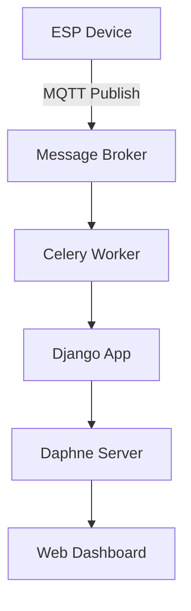

# Final Project
---
This final year project implements a **Smart IoT-based Nurse Call and Monitoring System** for hospital wards and operating theatres.

The system extends traditional hardwired nurse call buttons into a **modular, real-time, and secure IoT platform**. It combines **ESP32/ESP8266 microcontrollers** (with sensors and emergency buttons) and a **Django backend** running inside Docker with Redis, Celery, Mosquitto (MQTT), and WebSockets.

Key functionality includes:
- 🚨 **Nurse Call & Code Blue alerts** with real-time acknowledgement.
- 🏷 **RFID-based patient identification** linked to bed and ward dashboards.
- 📡 **Sensor monitoring**: motion inactivity, loud sound events (e.g., falls), temperature & humidity.
- 💡 **Remote light control** and on-device fail-safe automations.
- 📊 **Web dashboards** for Nurses, Doctors, Admin Clerks, and Theatre, all updated live via WebSockets.
- 🗂 **Audit trails & logs** for safety-critical accountability.

This prototype demonstrates how **open-source IoT tools** (ESPHome, MQTT, Django, Docker) can provide hospitals with a **low-cost, scalable, and safety-critical monitoring system**.


---

## Disclaimer

This repository is public for **assessment purposes only**.  
All code and documentation are © 2025 [E Liebenberg].  

Reuse, redistribution, or modification of this code is **not permitted** without prior written consent.

---

## Requirements
- Python 3.13.0
- Docker
- Additional dependencies listed in `django/project/requirements.txt`  
  *(Note: the `requirements.txt` file lives **inside** `django/project/`.)*

---

## Project Structure
```
PROJECT_ROOT/
├── django/                   # Django project root
│   ├── accounts/             # User accounts app
│   ├── admin_clerk/          # Admin clerk app
│   ├── alerts/               # Alerts app
│   ├── bedside/              # Bedside unit app
│   ├── dashboard/            # Dashboard app
│   ├── doctors/              # Doctors app
│   ├── nurse/                # Nurse app
│   ├── patients/             # Patients app
│   ├── project/              # Django settings & entrypoints
│   │   ├── __init__.py
│   │   ├── asgi.py
│   │   ├── celery.py
│   │   ├── settings.py
│   │   ├── urls.py
│   │   ├── views.py
│   │   ├── wsgi.py
│   │   └── requirements.txt  # Python dependencies live here
│   ├── remotes/              # Remotes app
│   ├── static/               # Static assets (source)
│   ├── staticfiles/          # Collected static files (build output)
│   ├── templates/            # HTML templates
│   ├── theatre/              # Theatre app
│   ├── celerybeat-schedule   # Celery beat scheduler DB (local)
│   ├── db.sqlite3            # Local SQLite DB (dev)
│   ├── Dockerfile            # Django image
│   ├── manage.py             # Django management script
│   └── start-celery.sh       # Celery startup helper
│
├── esphome/                  # ESPHome / infra configs
│   ├── cache/
│   ├── config/               # YAML configs for ESP devices
│   ├── homeassistant/
│   └── mosquitto/
│
├── .env                      # Local environment variables (not committed)
├── docker-compose.yml        # Docker Compose orchestration
└── README.md                 # This file
```
An `.env.example` file is included in the bundle — copy it to `.env` and adjust values as needed.

---

# Quick Start Setup
> Tip: Do **not** commit secrets. Use a `.env` file (see below) and keep it out of version control.

### TL;DR Setup
1. Clone the repo
2. Create `.env` from `.env.example`
3. Run `docker compose up -d`
4. Create Django superuser
5. Visit http://localhost:8000

## Clone & Create Virtual Environment
```bash
git clone https://github.com/ELUOL/Submission-Repo.git
cd Submission-Repo

# Create & activate a virtual environment
python -m venv .venv
# macOS/Linux:
source .venv/bin/activate
# Windows (Powershell):
.venv\Scripts\Activate.ps1
```

## Install Dependencies
```bash
# Install from the requirements located inside django/project/
pip install --upgrade pip
pip install -r django/project/requirements.txt
```

## Environment Variables
In the root directory, create a `.env` file and ensure it is correctly filled. Example:

```
# Django Settings
DJANGO_SECRET_KEY=SuperSecretKey
DEBUG=True
ALLOWED_HOSTS=localhost,127.0.0.1

# Database Settings (SQLite by default; PostgreSQL optional)
DB_NAME=your_db_name
DB_USER=your_db_user
DB_PASSWORD=your_db_password
DB_HOST=db
DB_PORT=5432

# Redis Settings
REDIS_HOST=redis_server
REDIS_PORT=6379
CELERY_BROKER_URL=redis://redis:6379/0
CELERY_RESULT_BACKEND=redis://redis:6379/0

# MQTT Settings
MQTT_HOST=mqtt
MQTT_PORT=1883
MQTT_USERNAME=<MQTT_USER>
MQTT_PASSWORD=<MQTT_PASS>
MQTT_BROKER=mqtt

# Wi-Fi (if used with ESP devices)
WIFI_SSID=YourWifiSSID
WIFI_PASSWORD=YourWifiPassword
```

---

## Docker Setup

### Ensure Docker Desktop is running
On Windows: open Docker Desktop and ensure it's active.

### (Optional but recommended) Rebuild clean  
**Note:** this will stop and remove existing containers.

```bash
docker compose down -v
docker compose up --build
```

### Create a Password for the MQTT Broker
```bash
docker run --rm -v "${PWD}/mosquitto/config:/mosquitto" eclipse-mosquitto   mosquitto_passwd -b /mosquitto/passwd <MQTT_USER> <MQTT_PASS>
```
- **username:** `<MQTT_USER>`  
- **password:** `<MQTT_PASS>`  

---

## Database Setup
```bash
# From the project root (where docker-compose.yml is located)
docker exec -it django_app python manage.py makemigrations
docker exec -it django_app python manage.py migrate
docker exec -it django_app python manage.py createsuperuser
```

### Collect Static Files
```bash
docker exec -it django_app python manage.py collectstatic --noinput
```

You can now log into Django Admin at:  
http://localhost:8001/admin

---

## Visit the Web App
- Main App (via Daphne): http://localhost:8000  
- Django Admin (via backend service): http://localhost:8001/admin  

---

## Services

| Service           | Container Name       | URL / Port            |
|-------------------|----------------------|-----------------------|
| Django App        | `django_app`         | http://localhost:8001 |
| Daphne (ASGI)     | `daphne_server`      | http://localhost:8000 |
| Celery Default    | `celery_default`     | —                     |
| Celery Theatre    | `celery_mqtt_theatre`| —                     |
| Celery Alerts     | `celery_mqtt_alerts` | —                     |
| Celery Bedside    | `celery_mqtt_bedside`| —                     |
| Automation UI     | `home_assistant`     | http://localhost:8123 |
| Redis             | `redis_server`       | tcp://localhost:6379  |
| Device Builder    | `esphome_server`     | http://localhost:6052 |
| Message Broker    | `mqtt_broker`        | tcp://localhost:1883  |

---

## Device Firmware Upload (optional)
To upload code to an ESP device, either:
- Use Device Builder Web UI (`http://localhost:6052`), or  
- Upload directly via USB:  

```bash
cd ./esphome/config/
esphome run "NameOfTheESP.yaml"
```
It will ask for the COM port or auto-detect your ESP board if connected.

---

## ESPHome Secrets

In `esphome/config/`, create a file called `secrets.yaml` to store private credentials.  
 **Do not commit this file to GitHub.** It is automatically ignored by `.gitignore`.

Example:

```yaml
wifi_ssid: "<YOUR_WIFI_SSID>"
wifi_password: "<YOUR_WIFI_PASSWORD>"

mqtt_broker: "<YOUR_MQTT_BROKER_IP>"
mqtt_username: "<MQTT_USER>"
mqtt_password: "<MQTT_PASS>"

api_encryption_key: "<GENERATED_KEY>"
ota_password: "<SECURE_OTA_PASSWORD>"
```

ESPHome will automatically substitute these values in your YAML configs (e.g., `wifi: ssid: !secret wifi_ssid`).

---

## System Overview



---

## Notes & Limitations
- Project is configured for **local testing** (SQLite + Docker).  
- In production, switch to **PostgreSQL** and configure **secure MQTT credentials**.  
- Default secrets in `.env.example` are placeholders only.  
- ESPHome `api_encryption_key` and `ota_password` should always be regenerated.  

---

## Future Work
- Replace SQLite with PostgreSQL for production-ready deployments.
- Add TLS/SSL encryption for MQTT and Django services. 
- Extend dashboard for multi-device, multi-room monitoring.  
- Explore automated deployment with CI/CD pipelines.

---

## Contribution Notice
This repository is for submission only — external contributions are not accepted.

---

## License
This repository is made public only for submission and review.  
Reuse or redistribution of code is **not permitted**.
